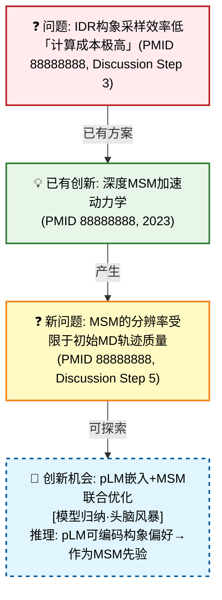
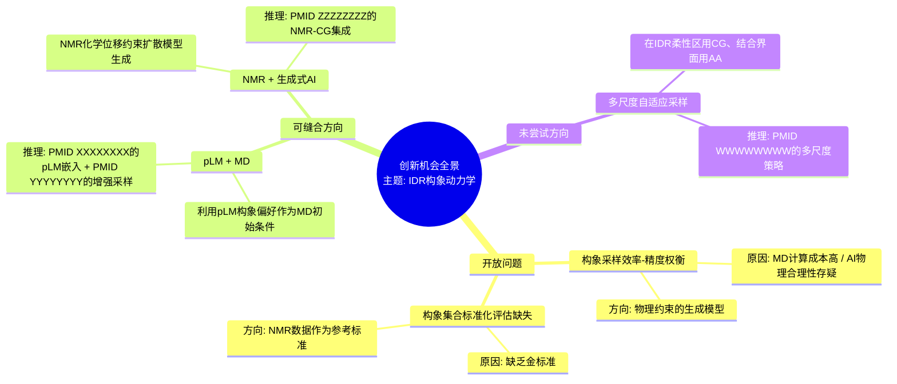
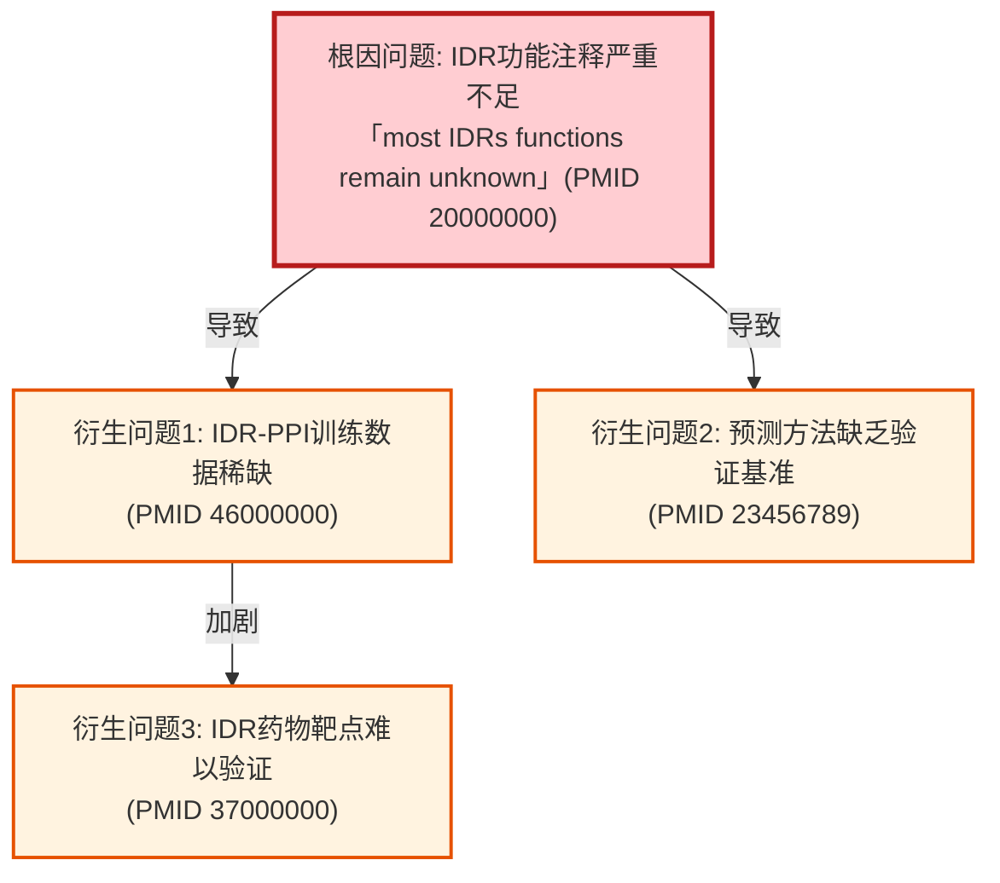

# 可视化类型详解 (dc-analysis)

## 4种核心Mermaid图表 + 2种表格

---

### 1. 问题-创新逻辑链图 ⭐（核心可视化）

**用途**：展示"旧问题→已有创新→产生的新问题→可能的创新方向"的因果逻辑链条，方便代入思考真实问题与创新机会。

**语法示例**：


**节点颜色编码**：
- 红色（problem）：现有真实问题
- 绿色（innovation）：已有的创新方案
- 黄色（new_problem）：创新产生的新问题
- 蓝色虚线（opportunity）：`[模型归纳·头脑风暴]` 的创新机会

**边类型**：
- `已有方案`：问题→已有创新
- `产生`：创新→产生的新问题
- `可探索`：新问题→创新机会
- `未解决`：问题→开放问题（无创新对应）

---

### 2. 创新机会脑图 ⭐

**用途**：全景展开开放问题、未尝试方向和可缝合方法，直观代入思考。

**语法示例**：


**脑图组织**：
- 根节点：聚焦的主题
- 一级分支：开放问题 / 可缝合方向 / 未尝试方向
- 二级分支：具体问题或方向
- 三级分支：原因分析、缝合来源、推理依据

---

### 3. 问题依赖网络

**用途**：展示问题之间的根因/层级/相关关系，找出根本性问题。

**语法示例**：


**边类型**：
- `导致`：A问题是B问题的根本原因
- `加剧`：A问题恶化B问题
- `关联`：两个问题互相影响

---

### 4. 讨论五步流程图

**用途**：展示单篇论文的Discussion论证结构和各步骤的关键发现。

**语法示例**：
```mermaid
flowchart TD
    S1[Step 1: 重述结论<br/>「我们证明了X方法有效」<br/>(PMID 12345678)]:::step1
    S2[Step 2: 对比前人<br/>「比Y方法在Z指标上提升15%」<br/>(paper_1-3)]:::step2
    S3[Step 3: 局限性<br/>「但数据集仅限于膜蛋白」<br/>(PMID 12345678)]:::step3
    S4[Step 4: 解决方案<br/>「扩展到更多蛋白类型」<br/>(PMID 12345678)]:::step4
    S5[Step 5: 新问题<br/>「不同膜环境是否影响？」<br/>(PMID 12345678)]:::step5
    
    S1 --> S2 --> S3 --> S4 --> S5

    classDef step1 fill:#e1f5fe,stroke:#01579b
    classDef step2 fill:#e8f5e9,stroke:#2e7d32
    classDef step3 fill:#ffebee,stroke:#b71c1c
    classDef step4 fill:#fff3e0,stroke:#e65100
    classDef step5 fill:#f3e5f5,stroke:#4a148c
```

---

### 5. 创新点对比表

**用途**：横向对比不同论文的创新点和问题。

| 论文 | 创新声明 | 对比优势 | 局限/新问题 | 问题类型 |
|------|---------|---------|------------|---------|
| paper_1 | [创新声明] 「...」 | [对比优势] 「...」 | [原文声明] 「...」 | 数据局限 |
| paper_2 | [创新声明] 「...」 | [对比优势] 「...」 | [开放问题] 「...」 | 开放问题 |

---

### 6. 开放问题清单

**用途**：汇总所有未解决问题，并附上基于原文的创新机会头脑风暴。

| 问题ID | 问题描述 | 来源论文 | 为何未被解决 | 创新机会[模型归纳·头脑风暴] | 信心 |
|-------|---------|---------|------------|--------------------------|------|
| OP-1 | 构象采样精度-效率矛盾 | PMID 88888888, PMID 56000000 | MD计算限制 | 物理约束+生成式ML混合架构 | 中 |
| OP-2 | IDR功能注释大规模化 | PMID 20000000 | 高通量实验缺乏 | pLM自动化功能推理pipeline | 高 |

---

## 图表示例选择指南

| 场景 | 推荐图表 |
|------|---------|
| 展示问题到创新的因果演变 | 问题-创新逻辑链图 |
| 全景展开未解决方向和可缝合方法 | 创新机会脑图 |
| 展示问题之间的根因关系 | 问题依赖网络 |
| 理解单篇论文的讨论深度 | 讨论五步流程图 |
| 跨论文创新优缺点对比 | 创新点对比表 |
| 系统整理未解决问题 | 开放问题清单 |
