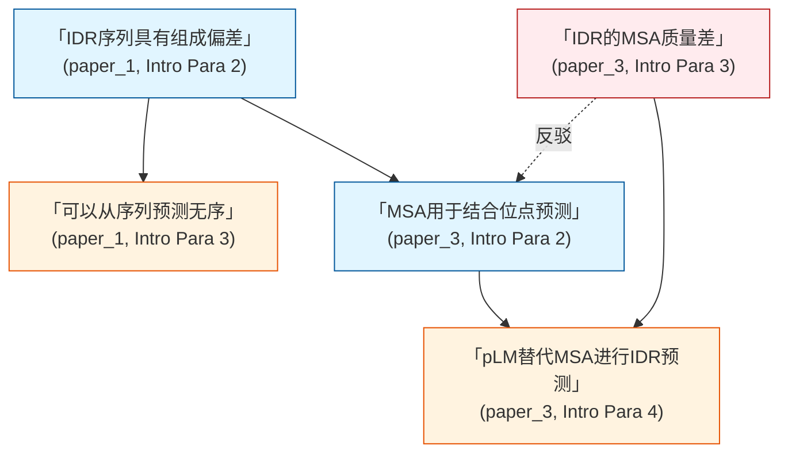

# 分析流程详细说明

## 三阶段分析流程

---

## 第一阶段：独立解析每篇文献

### 0. 文献元信息提取

**提取内容**：
- **完整引用格式生成**：使用可用信息生成标准引用
- **元信息验证**：验证输入的元信息一致性
- **缺失信息标记**：使用 `[未明确给出]` 标记缺失字段

**引用格式**：
```
完整格式：作者, 年份. 标题. 期刊. DOI/PMID
示例：Smith et al., 2023. Deep Learning in Medical Imaging. Nature Medicine. doi:10.1038/s41591-023-01234-5
```

### 1. 研究定位与第一性原理

**提取内容**：
- **第一性原理陈述**：用大白话讲清楚研究领域基础原理
- **研究领域/问题**：宽泛背景 + 具体问题
- **研究切入点**：作者选择的切入点

**格式**：`(id: paper_id, 具体位置: Introduction第X段)`
**标签**：`[原文声明]` 或 `[模型归纳]`

### 2. 历史脉络

**提取内容**：
- 早期研究："[年份] [作者/方法]..."
- 里程碑工作：标志性进展
- 近期进展：3-5年内的最新工作

**格式要求**：
- 保留原引言中的引用标记
- 格式为 `(id: paper_id, Introduction第X段)`
- 引用原文陈述

### 3. 研究现状分类

**提取内容**：
- 现有研究的主要类别（如："目前主要分为三类方法"）
- 每类方法的核心思路

**来源**：`(id: paper_id, Introduction第X段)`
**标签**：
- 作者直接陈述 → `[原文声明]`
- 归纳分类 → `[模型归纳]`

### 4. 研究缺口

**提取内容**：
- **转折词识别**：however / nevertheless / despite these advances / yet
- **缺口的四类**：
  - 研究空白领域（gap）
  - 前人研究的错误
  - 结果矛盾冲突
  - 技术瓶颈/限制

**来源**：`(id: paper_id, Introduction最后一段/第X段)`
**证据标注**：引用原文转折句

### 5. 核心观点

**提取内容**：
- 作者的主要论断
- 对前人研究的评价
- 提出的新思路
- **观点依赖关系**：A观点依赖B观点，或A观点反驳B观点

**格式**：`(id: paper_id, Introduction第X段)`
**标签**：`[原文声明]` 或 `[模型归纳]`
**证据标注**：引用原文陈述

### 6. 关键参考文献

**提取内容**：
- 被多次引用的奠基性工作
- 作者认同/反驳的具体观点

**引用类型**：支持、反对、延伸、引用
**格式**：`[Citation] (cited_by: paper_id, type: support/reject)`
**注意**：对于二手引用，标注为 `[引用文献未详述]`

### 7. 引言结构分析

**基于顶刊Introduction三步法分析**：
- **第一步：建立研究背景** - 为什么重要（宽泛 → 具体）
- **第二步：指出研究缺口** - 现有研究缺什么
- **第三步：提出研究问题** - 你的贡献在哪里
- **引言质量评级**：✅优秀 / ⚠️一般 / ❌较差
- **标签**：`[模型归纳]`

### 8. 原文-分析配对 ⭐

**这是第一阶段最关键的质量控制步骤。**

对每篇文献提取的所有内容，检查并确保：

1. **每条 `[原文声明]` 后必须有 `[模型归纳]` 分析**
   - 不能堆砌原文而不作分析
   - 分析必须基于原文推演，不得凭空编造
   
2. **分析深度要求**（按citation-rules.md中的层级）：
   - 关键发现：至少达到Level 2（跨文献关联）
   - 核心观点：至少达到Level 2
   - 研究缺口：至少达到Level 2
   - 鼓励达到Level 3（深层推理）对核心发现

3. **反堆砌检查**：
   - 扫描所有 `[原文声明]`，确保不超过连续2条无 `[模型归纳]` 间隔
   - 合并多篇同主题原文为一句原文+一句综合分析

---

## 第二阶段：跨文献综合分析

### 1. 自动识别研究主题

**原则**：不预设任何主题，从引言中自动识别

**提取内容**：
- 每篇论文涉及的具体研究方向
- 主题的聚类和命名
- 主题之间的关系（父子主题、独立主题、交叉主题）

**标签**：`[模型归纳]`

**可视化**：使用Mermaid mindmap

### 2. 每个主题的深度展开 ⭐

**这是第二阶段最核心的任务。每个识别的主题必须获得独立的、深入的、完整的分析章节。不能浅尝辄止，不能几行带过。**

#### 每个主题必须包含以下8个组成部分：

#### 2.1 主题定义与范围界定

**内容**：
- 该主题的核心研究问题（一句话概括）
- 该主题在领域中的位置和重要性
- 该主题涵盖的子方向
- 该主题与其他主题的交叉关系

**标签**：`[模型归纳]` + 推理依据

**示例**：
```markdown
### 3.1 主题：蛋白语言模型用于IDR预测

**主题定义** [模型归纳]：该主题研究如何利用预训练的蛋白语言模型（ProtT5, ESM-2等）提取序列特征，替代传统MSA和手工特征，用于无序区域和结合位点的预测。该主题是"无序预测"和"深度学习"两个方向的交叉领域。

**推理依据**：paper_3、paper_7、paper_12均在引言中将pLM作为替代MSA的核心技术创新点。
```

#### 2.2 方法论演进时间线

**内容**：
- 该主题内关键方法的提出时间和标志性工作
- 按照 `[原文声明]` + `[模型归纳]` 配对的格式交替呈现
- 至少3个时间节点

**格式**：每个时间节点 = `[原文声明]`（原文引用） + `[模型归纳]`（该工作在主题中的意义分析）

**示例**：
```markdown
**2018** - [原文声明] 「ANCHOR2 performed best by using biophysics-based energy functions」（paper_3, Introduction第2段）
  [模型归纳] 标志着物理能量函数的成熟，但同时也暴露了纯物理方法的局限——无法利用进化信息。

**2020** - [原文声明] 「Methods outperformed ANCHOR2 through using homology-based inference and MSAs」（paper_3, Introduction第2段）
  [模型归纳] 进化信息的引入带来了显著提升，但也引入了对高质量MSA的依赖，这在IDR领域恰恰是弱项。

**2022+** - [原文声明] 「Protein language models present a novel approach without explicitly using MSAs」（paper_3, Introduction第3段）
  [模型归纳] pLM的出现解决了"需要MSA但IDR的MSA质量差"的根本矛盾，标志着该主题的技术路线转向。
```

#### 2.3 方法论分类与比较表格

**内容**：该主题内不同方法路线的系统比较

**格式**：
| 类别 | 代表方法 | 核心思路 | 优势 | 局限 | 代表文献 |
|-----|---------|---------|------|------|---------|
| 物理方法 | ANCHOR2 | 基于能量函数 | 无需训练数据 | 无法利用进化信息 | paper_3 |
| MSA方法 | ... | ... | ... | MSA质量依赖 | paper_3 |
| pLM方法 | IDBindT5 | 单序列embedding | 避免MSA依赖 | 可解释性差 | paper_3, paper_7 |

#### 2.4 核心观点与争议

**内容**：
- 该主题内不同文献的共同观点
- 该主题内的对立观点或争议
- 每条观点使用 `[原文声明]` + `[模型归纳]` 配对格式

**要求**：
- 至少识别1个争议点
- 对立观点必须并置展示
- `[模型归纳]` 分析争议的本质和原因

#### 2.5 研究缺口

**内容**：该主题面临的具体研究缺口（至少2个）

**格式**：每个缺口 = `[原文声明]` + `[模型归纳]`（该缺口的严重程度和影响分析）

#### 2.6 观点依赖图

**内容**：该主题内观点的依赖、反驳、扩展关系

**可视化**：**必须使用Mermaid graph语法，禁止ASCII文本替代**

**节点要求**：每个节点包含原文引用和来源标注

**示例**：


#### 2.7 代表性文献列表

**内容**：该主题内的关键文献及完整引用

**格式**：
| ID | 标题 | 作者 | 年份 | 核心贡献（该主题内） |
|----|------|------|------|-------------------|
| paper_3 | IDBindT5 | ... | 2023 | 首个pLM-based IDR结合位点预测 |
| paper_7 | ... | ... | 2024 | pLM embedding用于多类型结合位点 |

#### 2.8 该主题的未来方向

**内容**：基于该主题现有缺口和趋势推演的未来方向

**标签**：`[模型归纳]` + 推演依据说明

**注意**：只推演有文献支持的未来方向，不编造

---

### 3. 构建领域时间线

**内容**：
- 合并所有历史脉络信息
- 按时间排序
- 标注不同文献对同一事件的不同叙述

**证据标注**：每条时间线记录都有来源文献，使用 `[原文声明]` + `[模型归纳]` 配对
**可视化**：**必须使用Mermaid timeline语法，禁止ASCII替代**

### 4. 观点追踪与论战

**识别并分类**：
- **共同观点**：哪些文献支持同一说法
- **对立观点**：哪些文献相互矛盾
- **观点演进**：同一观点在不同时期的表述变化
- **观点依赖关系**：A观点引出B观点，A观点依赖C观点

**对比表格**（每条观点使用 `[原文声明]` + `[模型归纳]` 配对）：
| 观点主题 | 观点表述（原文） | 标签 | 支持文献 | 反对/质疑文献 | 依赖观点 | 证据 |
|---------|-----------------|------|---------|--------------|---------|------|
| X方法有效 | 「X method achieves state-of-the-art performance on scenario A」 | [原文声明] | paper_a, paper_c | paper_d | - | (paper_a, Intro Para 3) |

### 5. 观点依赖图

**展示内容**：观点之间的相互调用、依赖、反驳关系

**可视化**：**必须使用Mermaid graph，禁止ASCII替代**

**关系类型**：直接依赖、引出、反驳、扩展、基于

### 6. 论证流程图

**展示内容**：文献的论证逻辑链

**可视化**：**必须使用Mermaid flowchart，禁止ASCII替代**

### 7. 观点演进序列图

**展示内容**：观点随时间的演进和互动

**可视化**：**必须使用Mermaid sequence diagram，禁止ASCII替代**

### 8. 研究范式状态转换图

**展示内容**：研究范式的转换

**可视化**：**必须使用Mermaid state diagram，禁止ASCII替代**

**节点要求**：每个状态节点包含时期标注、文献引用和 `[原文声明]` / `[模型归纳]` 标签

### 9. 研究缺口综合

**分类整理**：
- 被广泛共识的缺口 vs. 争议性缺口
- 哪些缺口已被后续研究填补
- 缺口之间的依赖关系

**可视化**：缺口依赖关系建议使用 Mermaid graph

**对比表格**：
| 缺口ID | 缺口描述（原文+分析） | 标签 | 提出文献 | 填补状态 | 填补文献 | 依赖缺口 | 争议性 |
|-------|-----------------|------|---------|---------|---------|---------|-------|

---

## 第三阶段：生成综述报告

### 输出文件命名

**格式**：`[输入文件名]_intro_[YYYYMMDD].md`

**示例**：
- 输入文件：`medical_papers.md`
- 保存文件：`medical_papers_intro_20260521.md`

### 对话中显示的简要摘要

**格式**：
```markdown
✅ 分析完成

📊 分析统计
- 文献数量：N篇
- 识别主题：X个（每个主题均已完成深度展开）
- 时间跨度：[起始年] - [结束年]
- 数据来源：仅从Introduction部分提取

📁 输出文件
- 路径：[文件路径]
- 格式：Markdown (.md)

🔍 主要发现
- 核心主题1：[简要描述]
- 核心主题2：[简要描述]
- 主要争议：[简要描述]

💾 查看建议
- 文件已保存，可使用任何markdown编辑器查看
- 报告包含完整的Mermaid可视化图表（mindmap/timeline/graph/flowchart/sequence/state）
- 所有观点都有原始文献引用和配套分析
```

---

## 分析流程质量控制

### 第一阶段检查：
- [ ] 每篇文献的元信息提取完整
- [ ] 历史脉络有时间线索
- [ ] 研究缺口有转折词证据
- [ ] 核心观点有原文引用
- [ ] 引言结构分析有评级
- [ ] **每条 `[原文声明]` 有配套 `[模型归纳]` 分析**
- [ ] **无连续3条以上纯原文引用**

### 第二阶段检查：
- [ ] 主题识别不预设
- [ ] **每个主题有完整的8部分深度展开**
- [ ] 时间线按年排序
- [ ] 观点论战明确对立
- [ ] **所有图表使用Mermaid语法（无ASCII替代）**
- [ ] 观点依赖图关系明确
- [ ] 研究缺口分类清晰

### 第三阶段检查：
- [ ] 文件命名正确
- [ ] 简要摘要简洁
- [ ] 完整报告已保存
- [ ] 不包含引言写作指导章节