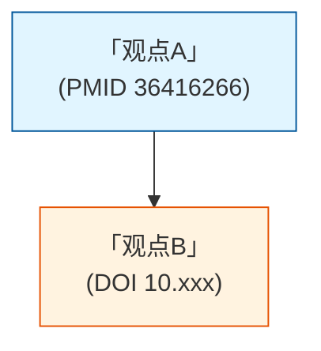

# 输出格式与保存规则

## 输出文件结构

### 完整报告模板

```markdown
# [领域名称] 文献综述

## 执行摘要 (Executive Summary)
- 分析文献数量：N篇
- 时间跨度：[起始年] - [结束年]
- 自动识别的主题：[列出所有主题]
- 核心争议：[列出2-3个]
- 数据来源说明：所有信息均来自引言部分

## 0. 研究主题全景 (Theme Overview)

### 主题关系图
[Mermaid mindmap]

### 主题列表
[所有识别的主题及简要描述]

## 1. 领域发展时间线 (Domain Timeline)
[Mermaid timeline图表，每条记录都有原文引用]

## 2. 研究范式演进 (Paradigm Evolution)
[Mermaid state diagram，每条转换都有原文引用]

## 3. 主题深度分析 (In-Depth Theme Analysis)

**每个识别的主题必须独立深度展开，包含完整的8个组成部分。禁止对任何主题浅尝辄止（如仅用5行要点带过）。**

### 3.X [主题名称]

#### 主题定义与范围界定
- 核心研究问题（一句话概括）
- 在领域中的位置和重要性
- 涵盖的子方向
- 与其他主题的交叉关系
- 以上均为 `[模型归纳]` + 推理依据

#### 方法论演进时间线
- 该主题内关键方法的提出时间（至少3个节点）
- 每个节点：`[原文声明]`（原文引用） + `[模型归纳]`（该工作在主题中的意义）
- 使用 `[原文声明]` → `[模型归纳]` 交替格式

#### 方法论分类与比较
| 类别 | 代表方法 | 核心思路 | 优势 | 局限 | 代表文献 |
|-----|---------|---------|------|------|---------|
| ... | ... | ... | ... | ... | ... |

#### 核心观点与争议
- 共同观点（多文献支持）：`[原文声明]` + `[模型归纳]` 配对
- 对立观点/争议（至少1个）：对立并置 + `[模型归纳]` 分析争议本质
- 观点来源标注：`(DOI: 10.xxx/yyy)` 或 `(PMID: 12345678)`

#### 研究缺口
- 该主题的具体缺口（至少2个）
- 每个缺口：`[原文声明]`（原文转折句） + `[模型归纳]`（缺口严重程度分析）
- 缺口类型标注：空白/错误/矛盾/瓶颈

#### 观点依赖图
**必须使用Mermaid graph语法，禁止ASCII/纯文本替代**


#### 代表性文献
| ID | 标题 | 作者 | 年份 | 核心贡献（该主题内） |
|----|------|------|------|-------------------|
| ... | ... | ... | ... | ... |

#### 未来方向
- 基于现有缺口和趋势推演
- `[模型归纳]` + 推演依据
- 只推演有文献支持的方向

---

[重复每个主题——每个主题都必须包含上述全部8个部分，且 `[模型归纳]` 必须纵向深入分析...]

## 4. 观点关系网络 (Viewpoint Relationship Network)

### 4.1 观点依赖总览
[Mermaid graph - 展示所有观点的依赖关系，节点含原文引用和DOI/PMID]

### 4.2 核心论证流程
[Mermaid flowchart - 展示论证逻辑链，节点含原文引用和DOI/PMID]

### 4.3 观点演进序列
[Mermaid sequence diagram - 展示时间序列演进，消息含原文引用和DOI/PMID]

### 4.4 观点对比表
[复杂表格 - 包含观点表述原文、标签、支持/反对、依赖关系、证据和DOI/PMID]

## 5. 研究缺口分析 (Research Gap Analysis)

### 5.1 缺口依赖图
[Mermaid graph - 展示缺口之间的依赖关系，节点含原文引用和DOI/PMID]

### 5.2 缺口对比表
[表格 - 缺口ID、描述原文、标签、提出文献(DOI/PMID)、填补状态、依赖关系、争议性]

### 5.3 已被填补的缺口 (Filled Gaps)
### 5.4 当前主要缺口 (Current Major Gaps)
### 5.5 争议性缺口 (Controversial Gaps)

> ⚠️ **注意**：intro-analysis 不包含"文献逐篇分析"章节。文献逐篇分析已从该skill中移除，原因是逐篇分析容易产生文献ID标注错误和幻觉。分析重点在于跨文献的主题归纳和综合分析。

## 6. 参考文献索引 (Reference Index)

### 6.1 文献元信息表
| DOI/PMID | 标题 | 作者 | 年份 | 期刊 | 完整引用 |
|----------|------|------|------|------|---------|
| PMID 36416266 | ... | ... | ... | ... | ... |
| 10.xxx/yyy | ... | ... | ... | ... | ... |

> **重要**：使用DOI（优先）或PMID作为唯一文献标识符，禁止使用paper_01等临时编号。

### 6.2 引用格式说明
- 完整格式：作者, 年份. 标题. 期刊. DOI/PMID
- 信息缺失处理：使用 `[未明确给出]`
- 二手引用处理：标注 `[引用文献未详述]`

## 7. 可视化图例 (Visualization Legend)
解释所有Mermaid图例和表格结构

## 8. 反质量检查 (Anti-Quality Check)
- [ ] 所有观点都有 `[原文声明]` 或 `[模型归纳]` 标签
- [ ] 所有原文引用都包含文献唯一标识DOI/PMID
- [ ] 所有不确定信息都标注为 `[未明确给出]` 或 `[不确定]`
- [ ] 所有文献都有完整引用格式
- [ ] 没有编造任何论文未声明的内容
- [ ] 没有外推论文未支持的结论
```

---

## 输出方式

### 核心原则

**只保存文件，不在对话中显示完整内容**

### 执行步骤

1. **生成完整报告**：按照上述结构生成完整的markdown报告
2. **直接保存到本地文件**：使用Write工具保存
3. **在对话中显示简要摘要**：仅显示关键信息

### 保存位置

**文件命名格式**：
```
[输入文件名]_intro_[YYYYMMDD].md
```

**示例**：
- 输入文件：`medical_papers.md`
- 保存文件：`medical_papers_intro_20260521.md`

- 输入文件：`papers/ai4s_research.md`
- 保存文件：`ai4s_research_intro_20260521.md`

**日期格式**：YYYYMMDD（年月日，无分隔符）

---

## 对话中显示的简要摘要

### 格式要求

```markdown
✅ 分析完成

📊 分析统计
- 文献数量：N篇
- 识别主题：X个
- 时间跨度：[起始年] - [结束年]
- 数据来源：仅从Introduction部分提取

📁 输出文件
- 路径：[文件路径]
- 格式：Markdown (.md)
- 大小：[文件大小]

🔍 主要发现
- 核心主题1：[简要描述]
- 核心主题2：[简要描述]
- 主要争议：[简要描述]

💾 查看建议
- 文件已保存，可使用任何markdown编辑器查看
- 报告包含完整的Mermaid可视化图表
- 所有观点都有原始文献引用
```

### 注意事项

- **仅显示简要摘要**：不在对话中显示完整的markdown报告
- **不显示长段落**：不在对话中显示长段落的详细分析
- **简洁明了**：摘要控制在10行以内

---

## 保存时机

### 保存流程

1. **生成完整报告后立即保存**
2. **质量检查通过后保存**
3. **保存成功后显示简要摘要**

### 质量检查清单

**反幻觉检查**：
- [ ] 所有观点都有 `[原文声明]` 或 `[模型归纳]` 标签
- [ ] 所有原文引用都使用原文英文
- [ ] 所有不确定信息都标注为 `[未明确给出]` 或 `[不确定]`
- [ ] 没有编造任何论文未声明的内容
- [ ] 没有外推论文未支持的结论
- [ ] 没有猜测缺失的信息

**文献可追溯性**：
- [ ] 每篇文献都有完整引用格式
- [ ] 每个观点都有来源文献ID
- [ ] 每个观点都有准确DOI/PMID标识（仅需ID，不需段落位置）
- [ ] 参考文献索引完整
- [ ] 信息缺失使用 `[未明确给出]`

**内容完整性**：
- [ ] 时间线包含所有关键事件
- [ ] 论战分析明确指出对立观点
- [ ] 研究缺口分类清晰
- [ ] Mermaid语法正确
- [ ] 表格格式正确
- [ ] 所有主题都已识别并分类
- [ ] 主题关系图完整
- [ ] 观点依赖图显示所有关系
- [ ] 图表都有图例说明

---

## 输出格式说明

### 文件格式

- **格式**：Markdown (.md)
- **编码**：UTF-8
- **扩展名**：`.md`

### 内容特点

- **Mermaid图表**：嵌入markdown中，可直接渲染
- **引用格式**：完整引用，可追溯到原始文献
- **原文标注**：所有观点都有 `(PMID: 12345678)` 格式的标注
- **双标签系统**：所有观点都有 `[原文声明]` 或 `[模型归纳]` 标签

### 可视化支持

- **Mermaid语法**：使用标准Mermaid语法
- **图表类型**：mindmap, timeline, graph, flowchart, sequence, state
- **渲染工具**：支持Markdown + Mermaid的编辑器（如Obsidian、VS Code、GitHub）

---

## 重要提醒

### 执行分析时

- ✅ 完整报告直接保存到本地文件
- ✅ 对话中仅显示简要摘要
- ❌ 不在对话中显示完整的markdown报告
- ❌ 不在对话中显示长段落的详细分析

### 文件命名

- ✅ 使用 `[输入文件名]_intro_[YYYYMMDD].md` 格式
- ✅ 日期格式为YYYYMMDD
- ✅ 保存到与输入文件相同的目录

### 内容要求

- ✅ 所有观点都有原文引用和DOI/PMID标注
- ✅ 所有不确定信息都明确标注
- ✅ 所有文献都有完整引用格式
- ✅ 所有图表都有图例说明