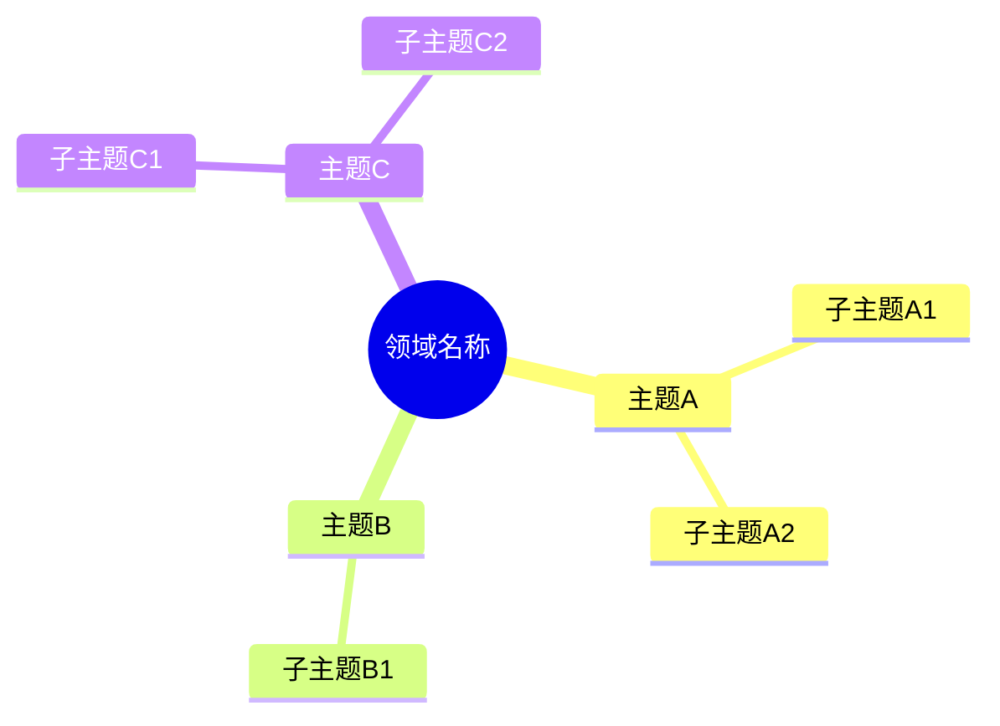
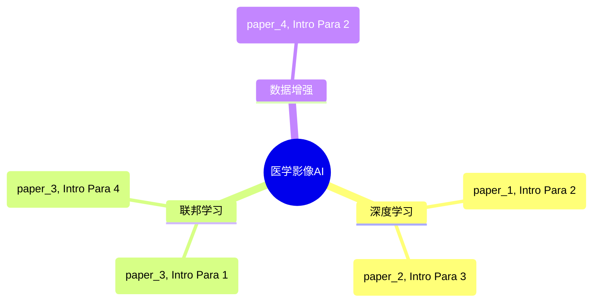
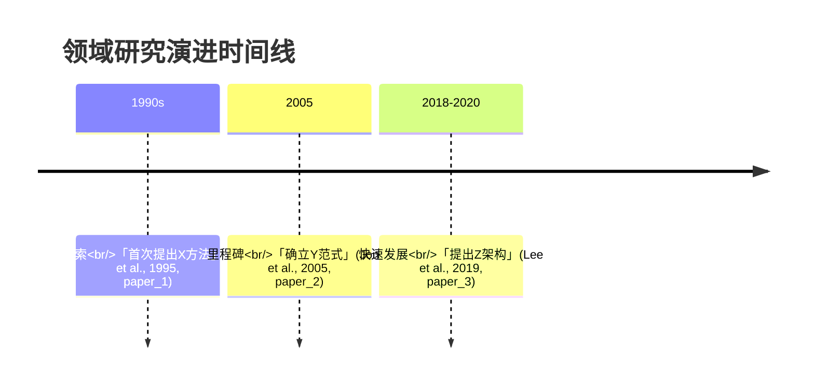
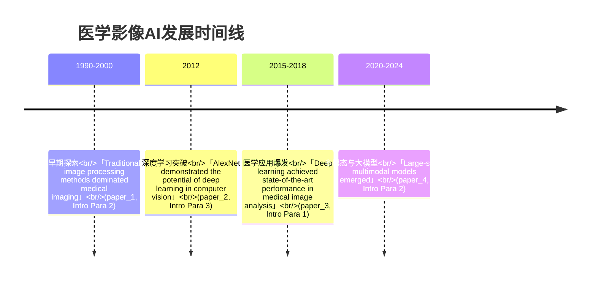
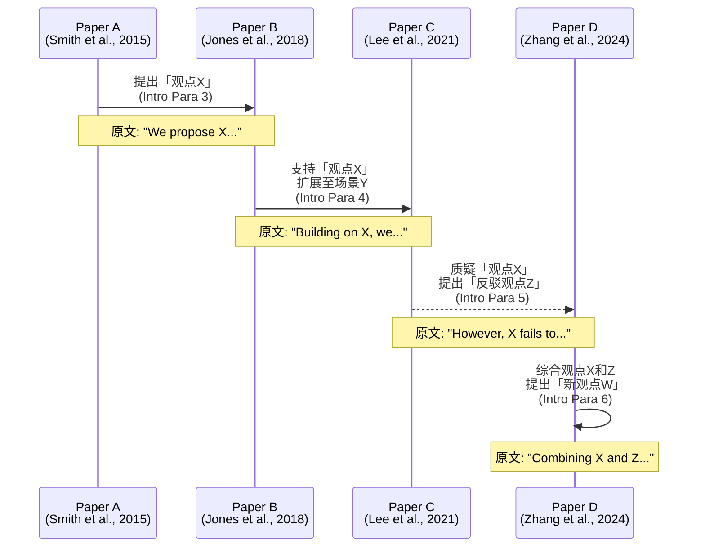
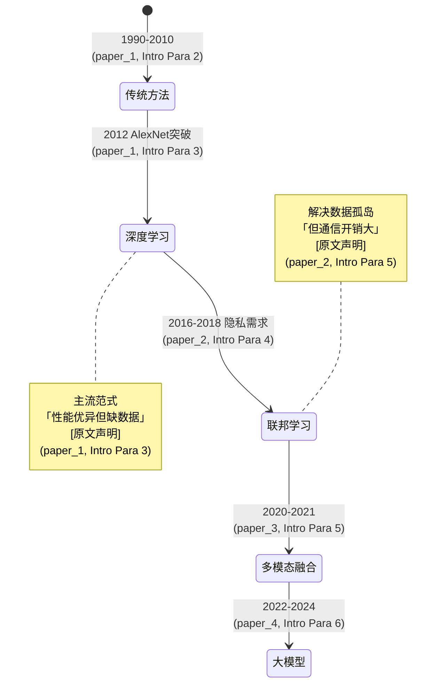

# 可视化类型详细说明

## 6种Mermaid图表类型

### 1. Mindmap（主题关系全景）

**用途**：展示研究领域主题的层级关系和分类

**语法**：


**原文引用要求**：主题说明中包含原文引用

**示例**：


---

### 2. Timeline（领域发展时间线）

**用途**：展示历史脉络、里程碑事件的时间演进

**语法**：


**原文引用要求**：每条时间线记录包含原文引用

**示例**：


---

### 3. Graph（观点依赖网络）

**用途**：展示观点之间的依赖、反驳、扩展关系

**语法**：
```mermaid
graph TD
    %% 基础观点节点
    A[「观点A」<br/>(paper_1, Intro Para 2)]:::base
    B[「观点B」<br/>(paper_2, Intro Para 3)]:::base

    %% 依赖关系
    C[「观点C」<br/>(paper_3, Intro Para 4)] --> A
    C --> B

    %% 反驳关系
    D[「观点D」<br/>(paper_4, Intro Para 5)] -.->|反驳| C

    %% 样式定义
    classDef base fill:#e1f5ff,stroke:#01579b,stroke-width:2px
    classDef derived fill:#fff3e0,stroke:#e65100,stroke-width:2px
    classDef counter fill:#ffebee,stroke:#b71c1c,stroke-width:2px

    class A,B base
    class C derived
    class D counter
```

**原文引用要求**：每个节点包含原文引用

**关系类型**：
- `A --> B`：直接依赖
- `A -.引出.-> B`：引出关系
- `A -.反驳.-> B`：反驳关系
- `A -.扩展.-> B`：扩展关系
- `A -.基于.-> B`：基于关系

**样式分类**：
- `base`：基础观点（蓝色）
- `derived`：衍生观点（橙色）
- `counter`：反驳观点（红色）

---

### 4. Flowchart（论证流程图）

**用途**：展示单个或多个文献的论证逻辑链

**语法**：
```mermaid
flowchart TD
    Start[「问题陈述」<br/>(paper_1, Intro Para 1)] --> Background1[「历史背景1」<br/>(paper_1, Intro Para 2)]
    Background1 --> Background2[「历史背景2」<br/>(paper_2, Intro Para 3)]
    Background2 --> Gap1[「研究缺口1」<br/>(paper_1, Intro Para 4)]
    Gap1 --> CounterArgument[「反方观点」<br/>(paper_2, Intro Para 5)]
    CounterArgument --> Gap2[「研究缺口2」<br/>(paper_1, Intro Para 5)]
    Gap2 --> Solution[「提出方案」<br/>(paper_1, Intro Para 6)]
    Solution --> Contribution[「贡献总结」<br/>(paper_1, Intro Para 7)]
```

**原文引用要求**：每个节点包含原文引用

---

### 5. Sequence（观点演进序列图）

**用途**：展示观点随时间的演进和文献间的对话

**语法**：


**原文引用要求**：每条消息包含原文引用

---

### 6. State（研究范式状态转换图）

**用途**：展示研究范式的转换和演进

**语法**：


**原文引用要求**：每条转换包含原文引用

---

## 复杂表格设计原则

### 多维度对比表

| 观点主题 | 观点表述（原文） | 标签 | 支持文献 | 反对/质疑文献 | 依赖观点 | 证据 |
|---------|-----------------|------|---------|--------------|---------|------|
| X方法有效 | 「X method achieves state-of-the-art performance on scenario A」 | [原文声明] | paper_a, paper_c | paper_d | - | (paper_a, Intro Para 3) |
| X方法局限 | 「X method fails to generalize to scenario B」 | [原文声明] | paper_d | - | - | (paper_d, Intro Para 4) |
| 可能适用 | 「May have potential in low-resource settings」 | [模型归纳] | - | - | 观点1 | 实验数据有限 |

### 设计原则

1. **多维度对比**：不只列出支持/反对，还要显示依赖关系、演进趋势
2. **关系编码**：使用符号、颜色、边框区分不同类型的关系
3. **可追溯性**：每个观点都有来源标注和原文引用
4. **层次清晰**：主观点→子观点→论证细节的层次结构
5. **标签明确**：每条观点都有 `[原文声明]` 或 `[模型归纳]` 标签

---

## 可视化选择指南

| 场景 | 推荐图表类型 | 原因 |
|-----|------------|------|
| 展示研究领域分类和层级 | mindmap | 直观显示主题结构和子主题关系 |
| 展示历史发展脉络 | timeline | 时间序列清晰，便于追踪演进 |
| 展示观点之间的复杂关系 | graph | 支持节点间多种关系类型（依赖、反驳、扩展） |
| 展示论证逻辑链条 | flowchart | 线性流程清晰，便于理解推理过程 |
| 展示文献间的观点演进 | sequence | 时间顺序明确，便于追踪观点的传承和变化 |
| 展示研究范式的转换 | state | 状态变化清晰，便于理解范式转移 |

---

## 图表使用注意事项

1. **原文引用**：所有图表节点都必须包含原文引用和位置标注
2. **标签标注**：所有观点必须标注 `[原文声明]` 或 `[模型归纳]`
3. **图例说明**：每个图表都应有清晰的图例说明
4. **简洁明了**：避免节点过多，每张图控制在20个节点以内
5. **语法正确**：确保Mermaid语法正确，避免渲染失败
6. **可读性**：节点文字简洁，关键信息用原文引用支撑