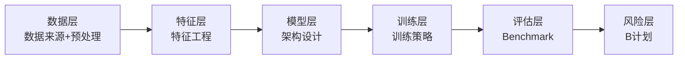
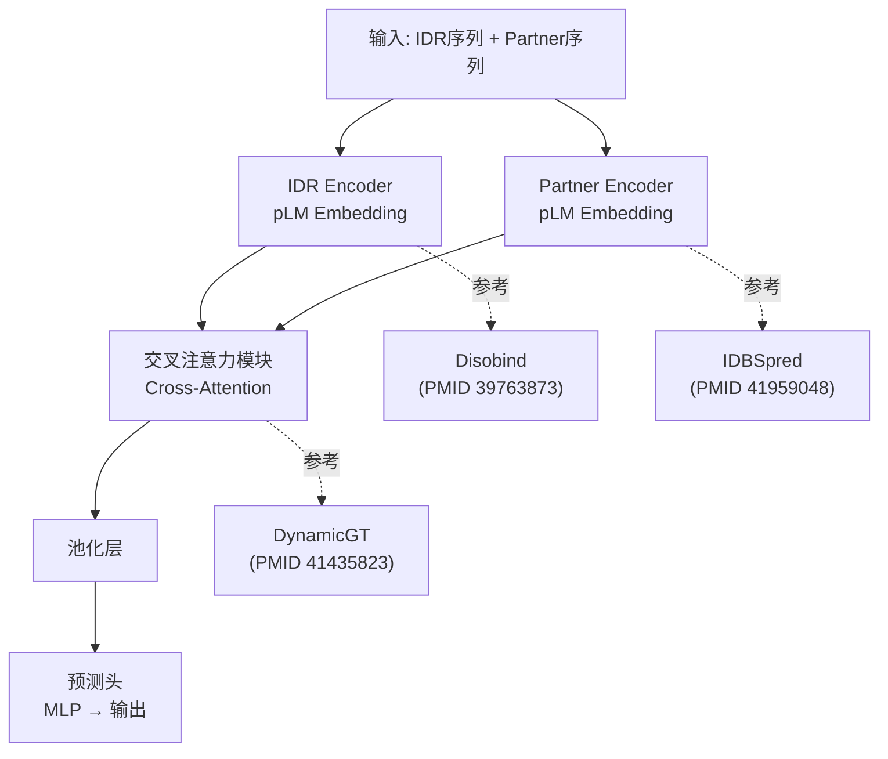

# Pipeline各环节设计模板

## 全Pipeline概览



---

## 1. 数据层设计模板

### 标准问题清单

每个方案必须回答以下问题：
1. **用什么数据**：具体数据库/数据集名称
2. **数据规模**：样本量、特征维度、类别分布
3. **获取方式**：公开下载/API/需申请/自建
4. **数据质量**：已知的噪声、缺失、偏差
5. **标注方式**：手工标注/自动标注/半监督
6. **数据划分**：Train/Val/Test比例和策略

### 数据来源模板

| 数据来源 | 类型 | 规模 | 获取方式 | 引用文献(PMID/DOI) | 优势 | 局限 |
|---------|------|------|---------|-------------------|------|------|
| DIBS | IDR-PPI复合物 | >700 | 公开 | PMID XXXXXXXX | 非冗余、高质量 | 仅binary复合物 |
| ... | ... | ... | ... | ... | ... | ... |

### 预处理Pipeline模板

```
[方案A] [名称] — 来源：(PMID XXXXXXXX)
├── Step 1: [操作] → [工具/库]
├── Step 2: [操作] → [工具/库]
├── Step 3: [操作] → [工具/库]
├── 优势：[...]
└── 局限：[...]

[方案B] [名称] — 来源：(PMID YYYYYYYY)
├── Step 1: [操作] → [工具/库]
├── Step 2: [操作] → [工具/库]
└── 选择建议：[什么场景选A，什么场景选B]
```

---

## 2. 特征层设计模板

### 特征工程方案

```
[方案A] pLM Embedding — 参考：(PMID XXXXXXXX)
├── 模型：ESM-2 / ProtT5 / ESMFold
├── 提取层：last hidden layer / attention pooled
├── 维度：1280 / 1024 / ...
├── 后处理：归一化 / PCA降维 / 直接使用
└── 优势：无需MSA，单序列输入，通用性强

[方案B] 手工特征 — 参考：(PMID YYYYYYYY)
├── 序列特征：氨基酸组成、二肽频率、CTD
├── 物理化学特征：疏水性、电荷、溶剂可及性
├── 进化特征：PSSM、HMM profile
└── 选择建议：小数据集用手工特征，大数据集用pLM

[模型归纳·方案推演] Fork选择：数据量<1000 → 方案B（手工特征稳定）；数据量>1000 → 方案A（pLM泛化强）。可融合A+B：pLM embedding + 手工特征concat。
```

---

## 3. 模型层设计模板

### 架构Schematic (Mermaid)



### 架构变体Fork

```
[方案A：推荐方案] 双塔 + 交叉注意力
├── 架构：[如上schematic]
├── 优势：模块化，各自预训练，可独立升级
├── 风险：交叉注意力的计算复杂度O(n²)
├── 参考实现：Disobind (PMID 39763873) + DynamicGT (PMID 41435823)
└── 适用场景：对精度要求高，计算资源充足

[方案B：轻量方案] 单塔 + 拼接
├── 架构：两个pLM embedding拼接 → MLP
├── 优势：简单，参数少，训练快
├── 风险：可能无法捕捉IDR-partner的复杂交互模式
├── 参考实现：IDBSpred (PMID 41959048)
└── 适用场景：快速原型、计算资源受限

[方案C：激进方案] 全Transformer + 预训练
├── 架构：从零训练的IDR-specific Transformer
├── 优势：可能最具表达力
├── 风险：数据量要求大，训练不稳定
├── 参考实现：ESM架构 + IDR-specific预训练
└── 适用场景：有大规模预训练数据和GPU资源
```

---

## 4. 训练层设计模板

### 训练配置表

| 组件 | 方案A | 方案B | 选择建议 |
|------|-------|-------|---------|
| Loss | Binary Cross-Entropy | Focal Loss (处理类别不平衡) | 正负样本比>10:1选Focal |
| Optimizer | AdamW (lr=1e-4) | SGD + Momentum | 大数据集选SGD |
| Scheduler | Cosine Annealing | ReduceLROnPlateau | 不确定训练时长选后者 |
| Regularization | Dropout(0.3) + Weight Decay(1e-4) | Dropout(0.5) + LayerNorm | 小模型防过拟合用后者 |
| Batch Size | 32 | 128 (梯度累积) | GPU显存受限时用累积 |
| Early Stopping | patience=10 on Val Loss | patience=20 on Val AUC | 轻度过拟合倾向选后者 |

### 训练技巧

```
├── 预训练策略：pLM冻结 vs 全参数微调 vs 渐进解冻
├── 数据增强：序列shuffle / 保守替换 / 回译
├── 半监督策略：自训练 / 伪标签 / 一致性正则
└── 每个技巧标注参考来源(PMID/DOI)
```

---

## 5. 评估层设计模板

### Baselines列表

| Baseline | 类型 | 选择理由 | 引用(PMID/DOI) | 是否有开源 |
|---------|------|---------|---------------|-----------|
| Disobind | 伙伴依赖 | SOTA for IDR-PPI | PMID 39763873 | 是/否 |
| IDBSpred | Partner侧 | 结构化蛋白侧baseline | PMID 41959048 | 是 |

### 评估指标

| 指标 | 公式/定义 | 适用场景 | 是否自创 |
|------|---------|---------|---------|
| ROC-AUC | 标准 | 通用分类 | 否 |
| 构象合理性得分 | [自创定义] | 评估预测是否符合构象约束 | 是 |

### 评估Protocol

```
1. 数据集：DIBS (PMID XXXXXXXX) + 自建数据集 (如有)
2. 划分策略：5-fold cross-validation, stratified by protein family
3. 统计检验：paired t-test across folds, p<0.05
4. 消融实验：
   - Ablation 1: 去掉交叉注意力模块 → 仅concat
   - Ablation 2: 去掉Partner信息 → 仅IDR侧
   - Ablation 3: 替换pLM → 手工特征
5. 可视化：预测界面 vs 实验界面叠加图 / t-SNE embedding
```

---

## Pipeline完整性检查

- [ ] 数据层：数据来源/规模/获取方式/划分策略 明确
- [ ] 特征层：至少2种可选方案，标注适用场景
- [ ] 模型层：核心架构Mermaid schematic + 2-3个变体Fork
- [ ] 训练层：Loss/Optimizer/Scheduler/Regularization 有具体选择
- [ ] 评估层：Baselines有选择理由/Metrics有定义/Protocol有步骤
- [ ] 风险层：每个高风险有B计划
- [ ] 所有方案组件有来源标注(PMID/DOI/仓库)
