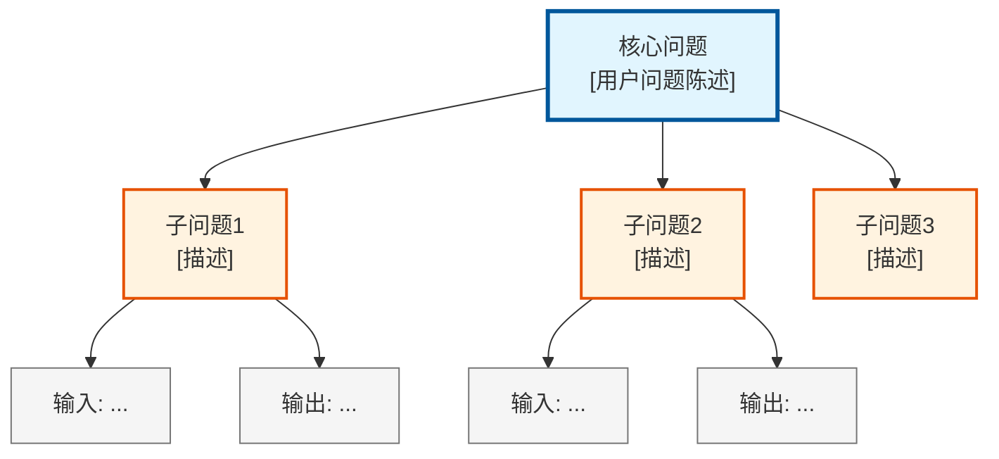
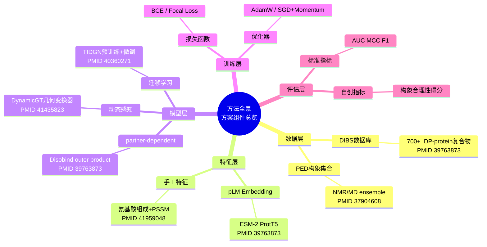
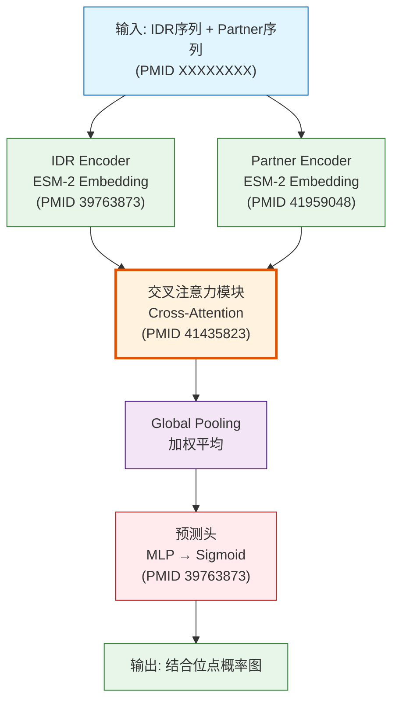
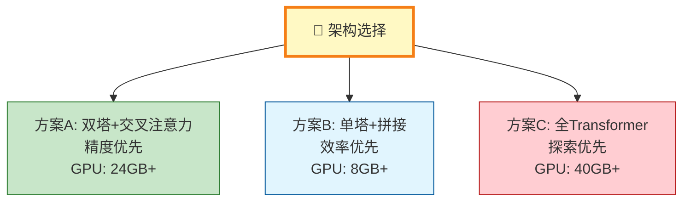
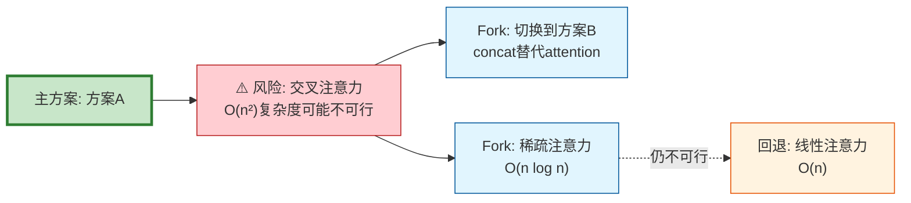

# 可视化类型详解 (method-analysis)

## 5种Mermaid图表 + 2种表格

---

### 1. 问题拆解树 (Mermaid graph)

**用途**：展示用户问题拆解为子问题树的层级结构。

---

### 2. 方法全景脑图 (Mermaid mindmap) ⭐

**用途**：展示全域Method + README中可复用组件按Pipeline阶段归类。

---

### 3. 架构Mermaid Schematic ⭐

**用途**：展示推荐方案的模型架构数据流和模块连接。

---

### 4. 方案Fork对比图 (Mermaid graph)

**用途**：展示关键环节的多个可选方案及其取舍关系。

---

### 5. 方案-风险-Fork逻辑链 (Mermaid graph)

**用途**：展示高风险的备选路径。

---

### 6. 训练策略对比表

| 组件 | 方案A（推荐） | 方案B（备选） | 选择条件 |
|------|------------|------------|---------|
| Loss | BCE | Focal Loss | 正负比>10:1选Focal |
| Optimizer | AdamW lr=1e-4 | SGD+Momentum | 大数据集选SGD |
| Scheduler | Cosine Annealing | ReduceLROnPlateau | 不确定epoch数选后者 |
| Regularization | Dropout 0.3 | Dropout 0.5 | 小模型加dropout |

---

### 7. 方法缝合溯源表

| 方案组件 | 来源论文(PMID/DOI) | 原文引用 | 开源仓库 | 缝合策略 | Pipeline位置 |
|---------|-------------------|---------|---------|---------|------------|
| 双塔embedding | PMID 39763873 | 「原文描述」 | Disobind | 组合 | 模型层→Encoder |
| ESM-2特征 | PMID 41959048 | 「原文描述」 | IDBSpred | 组合 | 特征层 |
| 交叉注意力 | PMID 41435823 | 「原文描述」 | DynamicGT | 迁移 | 模型层→交互 |
